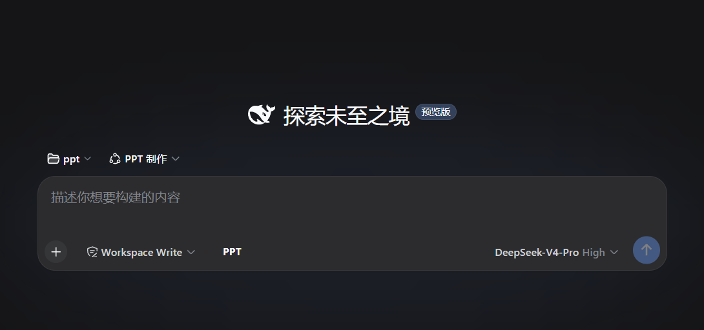

# ppt-reflex · 无需视觉模型，做出正确的 PPT

[](https://www.python.org/downloads/)
[](LICENSE)
[](ppt_reflex/grid/tests/)
[](pyproject.toml)
[]()
[]()

**ppt-reflex 是一个让没有视觉能力的 LLM 也能做出 *正确* PPT 的引擎 —— 外加 DeepSeek Harness（DSH）插件，提供实时 PNG 预览面板与点击/框选反馈闭环。**

盲 LLM（DeepSeek 优先，但任何纯文本模型都适用）看不到自己生成的 `.pptx`。ppt-reflex 反其道而行：AI 从不写坐标，也从不猜测视觉效果。它只声明**布局意图** —— 一个 archetype（布局原语）、一组参数、一个 recipe（组件配方）、一种装饰皮肤 —— 由确定性约束求解引擎算出每一个坐标、量出每一个字形，再用文本把结果反馈回来。

三样东西替代了视觉：

1. **真实字体测量** —— PIL 字形级 FreeType 度量（支持 CJK），在渲染 *之前* 算出文字真正需要的空间。
2. **结构化诊断** —— 每次构建都返回机器可读的问题列表，AI 可直接执行。
3. **三层 ASCII 反馈** —— L0 结构图、L1 元素图、L2 文本数值表，给模型一张它"看得懂"的图。

AI 读诊断、改声明、重跑。`CircuitBreaker`（熔断器）盯着机械式微调，在循环烧死自己之前强制转向设计级方案。

---

## 截图

### PNG 预览面板（v3）

面板展示的是引擎**真实渲染的 PNG** —— 与 `.pptx` 最终产出一致。点选元素或拖拽框选区域即可给反馈，反馈链路完整闭环。


*预览面板（第 4/8 页）：配色面板、区域反馈条目可见*

### PPT Maker Agent 会话

DeepSeek Harness 中的 `ppt-maker` 预设 agent 会话。输入栏左侧显示 PPT 预览按钮；agent 声明 deck 意图后 watcher 自动构建 + 渲染，面板实时更新。


*Agent 会话：「PPT 制作」预设已选，输入栏左侧 PPT 预览按钮可见*

---

## Agent-Engine 循环

```
            ┌─────────────────────────────────────────────┐
            │                LLM AGENT                    │
            │      （无视觉 —— 读 JSON，不看像素）          │
            │                                             │
            │   ① 声明意图                                │
            │      archetype + params + recipe + skin     │
            │   ② 读诊断 + L0/L1/L2 ASCII                 │
            │   ③ 决定修法 → declare_direction()          │
            └───────────────┬─────────────────▲───────────┘
                            │                 │
              声明          ▼                 │  诊断（JSON）
                            │                 │  + 三层 ASCII
            ┌───────────────▼─────────────────┴───────────┐
            │            引擎（确定性）                     │
            │  解析 archetype → phase1 布局 →              │
            │  碰撞检测 → 构图 → WCAG 对比度 →             │
            │  PIL 文字度量 → 冻结 → 往返校验              │
            │  + 自动渲染 PNG (_render_vision/)            │
            │  CircuitBreaker 守护修复循环                 │
            └───────────────┬─────────────────▲───────────┘
                            │                 │
                  build()   ▼                 │  fix_slide() / rebuild()
                            │                 │
             写出 .pptx —— ok:true = 视觉正确
             写出 .png  —— 面板展示真实渲染结果
```

**不是"AI 生成、人来修"，而是"AI 声明、引擎计算+渲染、AI 读结果、AI 决策、循环"。** 每个 LLM 都能读 JSON。这就是全部诀窍。

**设计哲学 —— 引擎说 AI 的语言。** 声明层刻意与 HTML/CSS 心智模型同构：这是无视觉模型最深的肌肉记忆。`grid_cards` 读起来像 CSS Grid，`fit_mode` 接受 `contain`/`cover`，`density` 接受 `comfortable`/`spacious`，`recipe` 像组件 class。**这不是 HTML→PPTX 转换** —— 引擎只是借用这套词汇，让盲 LLM 用已有的前端知识驱动布局。映射只存在于一处：`ppt_reflex/grid/agent_vocabulary.py`。

## 特性

- **天生盲 LLM 友好。** AI 不写坐标、不写原始 `python-pptx` 调用。它声明*要什么*，引擎解出*放哪*。
- **确定性约束求解。** 同样的声明 → 同样的布局，每次如此。
- **真实字体测量。** `text_metrics.py` 用 PIL/FreeType 做字形宽度测量，溢出在写文件 *之前* 被捕获。
- **结构化诊断。** 每条问题 `{slide, phase, kind, severity, message, options}`，去重 + 批量折叠。
- **三层 ASCII 反馈。** L0 结构图 · L1 元素图（`#` 重叠、`!` 溢出）· L2 文本数值表。
- **PNG 预览面板（DSH 插件）。** Watcher 构建时自动渲染 PNG，面板展示真实渲染结果（非帧流 canvas 重绘）。点选 / 框选 / 改色 / 提问，反馈链路完整。
- **双重正确性底线。** `geometry_ok` + `harmony_ok` —— 均为可验证底线，非主观审美。
- **OKLCH 色彩和谐规则。** 60-30-10 面积色彩比、焦点唯一性、色相和谐 —— 全部 OKLCH 度量。
- **熔断器守护修复循环。** 同方向两次 → WARN，三次 → BLOCK；机械微调 → BLOCK。
- **设计 token + recipe 体系。** `tokens.json` / `recipes.json` 持有分层值，recipe 预解 token。
- **审美判断留给人。** 引擎只执行客观底线（WCAG AA 对比度），不假装有品味。

## v2 新增（PNG 预览）

| 变更 | 说明 |
|:--|:--|
| **PNG 预览面板** | 面板展示引擎真实渲染的 PNG（`_render_vision/slide_XX.png`），而非帧流 canvas 重绘。所见即所得。 |
| **Watcher 自动渲染** | 每次 watcher 构建自动附带 PNG 渲染 —— 无需手动调 `renderSlides`。 |
| **新 RPC 接口** | `previewState`（PNG 列表 + 每页元素几何）和 `slideImage`（单页 PNG base64）。面板轮询 previewState。 |
| **帧文件降级** | `_frames_auto.jsonl` 不再是渲染源 —— 仅作为框选命中所需的元素几何数据。 |
| **直连 fetch 通信** | 面板直连宿主 RPC（不依赖 typert remotes 挂载链），用原生 `setInterval`，错误在状态栏可见。 |

## harmony v1 新增（取代 v0.6.0）

| 变更 | 说明 |
|:--|:--|
| **OKLCH 色彩核心** | `grid/oklch.py` —— sRGB↔OKLCH 转换、色相距离、明度/色度辅助 |
| **双通道诊断** | 违规 → `error`/`warning`（阻塞 ok）；信号 → `advisory`（永远保留） |
| **基于面积的色彩比** | 60-30-10 色带按填充面积度量 |
| **焦点唯一性** | 每页恰好一个焦点元素 |
| **色相和谐** | 单色/类似/互补/三色组，全部 OKLCH |
| **入口纪律** | `strict_tokens=True` 默认拒绝原始颜色/坐标 |
| **CSS 同构词汇** | `contain`/`cover`、`comfortable`/`spacious` |
| **区域诊断** | `inspect_slide(idx, elem_ids)` + `runner --inspect` |
| **双重门控** | `geometry_ok` **且** `harmony_ok` 同时通过才放行 |
| **熔断器持久化** | `build_count` 跨进程保存于 `_breaker_state.json` |
| **Watcher 自动构建** | deck 文件变化 → 自动构建（无需手动调用 runner） |
| **`ppt_build` 工具** | 宿主注册：`build` / `renderSlides` / `inspect` |

## 快速开始

### 安装

```bash
git clone https://github.com/lecutu/dsh-slide-reflex.git && cd dsh-slide-reflex
pip install -e .
```

Python 3.10+。运行时依赖：`python-pptx` 和 `Pillow`。

### 最小 deck

```python
from ppt_reflex.builder import PPTBuilder

b = PPTBuilder(template="business", style="corporate_minimal")
b.add_slide("为什么需要这个",
    archetype="content",
    elements=[
        b.title("python-pptx 是盲的"),
        b.bullet("文字溢出和不可见文字是无声的失败"),
        b.box("每个 LLM 都能读 JSON。\n不需要视觉。", recipe="card"),
    ],
)
result = b.build("output.pptx")
print(result["summary"])
```

### Runner 命令（DSH 桥接）

```bash
python _dsh_ppt_runner.py < deck_request.json
```

## DSH 插件工作流

```
用户说出需求
        │
        ▼
agent 问卷 → 生成 deck（archetype + params + recipe + skin）
        │
        ▼
写 D:\ppt\_deck_auto.json  ──►  host watcher 自动构建 + 渲染 PNG
        │
        ▼
面板轮询 previewState → 展示真实渲染 PNG
        │
        ▼
反馈循环：点选元素 · 框选区域 · 改色 · 提问
        │
        ▼
agent 改 deck  ──►  watcher 重新构建 + 渲染  ──►  面板更新
```

**构建触发 = 写 deck 文件。** Host watcher 监听 `_deck_auto.json`；变化时运行引擎并自动渲染 PNG —— 面板直接展示结果。

**工作流文件桥接：**

| 文件 | 用途 |
|:--|:--|
| `_deck_auto.json` | Deck 声明 —— **agent 只改这个文件** |
| `_render_vision/slide_XX.png` | 渲染后的 PNG（面板实时数据源） |
| `_frames_auto.jsonl` | 元素几何数据（用于框选命中，非视觉源） |
| `_feedback_auto.json` | 用户面板反馈（问题 / 区域） |
| `_selection_auto.json` | 元素选中状态 |
| `_palette_auto.json` | 面板配色（由 runner 合并，agent 不直接写） |
| `_breaker_state.json` | CircuitBreaker 跨进程持久化 |

完整插件文档、维护说明和故障排查：见 `plugins/dsh-slide-reflex/README.md` 和 `docs/`。

## API 一览

| API | 签名 | 用途 |
|:--|:--|:--|
| `PPTBuilder` | `PPTBuilder(template, style, overrides, page_w=960, page_h=540)` | AI 入口 |
| `add_slide` | `add_slide(title, *, archetype, params, regions, elements, arrows, frame, rail, corner_mark)` | 声明一页 |
| `title / subtitle / text / bullet / footer` | `(text, *, style, region)` | 文本原语 |
| `box` | `(text, *, recipe, ...)` | 卡片组件 |
| `shape` | `(shape_id, *, ...)` | 20 种形状 |
| `image` | `(path, *, fit_mode, ...)` | 等比适配图片 |
| `table` | `(headers, rows, *, region)` | 自动大小表格 |
| `build` | `(path)` | 完整构建 |
| `fix_slide / rebuild` | `(idx, ...)` / `(changed_slides, path)` | 增量重建 |
| `inspect_slide` | `(idx, elem_ids)` | 区域诊断 |
| `set_render_frame_hook` | `(fn)` | 流式预览回调 |
| `declare_direction` | `(direction)` | 修复策略（CircuitBreaker） |
| `list_templates / list_style_presets / list_archetypes` | `()` | 目录浏览 |

**12 种布局原型：** title_cover · content · two_column · comparison · data_showcase · grid_cards · image_hero · conclusion · section · quote · timeline · blank。

**6 个模板：** academic · business · minimal · data_report · teaching · product。
**6 种风格：** academic_rigorous · corporate_minimal · tech_dark · editorial_magazine · creative_vibrant · government_solemn。

## 逃生舱口

引擎是底线，不是天花板。三层逃生口让 agent 在声明能力不足时拿回控制权：

1. **手写区域。** 跳过 archetype，传入 `regions=[...]`。
2. **元素参数。** 每个原语接受覆盖 —— `pw`/`ph`、`fill_color`、`corner_radius`、`align_h`。
3. **Agent 接管代码。** 降到 raw `python-pptx` 或 `officecli` skill。

## 路线图

- ✅ **黄金集回归 (T6)** —— 基准 + runner + 110 通过测试（harmony v1 已落地）
- ✅ **PNG 预览面板** —— watcher 自动渲染、面板展示真实 PNG、框选反馈闭环
- **黄金用例收集** —— 从真实反馈中提取（`tools/golden_harvest.py`）
- **更多 recipe 和 token** —— 扩展人工维护的资产层
- **更多参数化原语** —— `columns`/`gap`/`density` 式参数推广到更多原型
- **参考 PPTX 布局提取** —— 把 `layout_extractor.py` 接入 `register_archetype()`
- **ASCII → 诊断交叉链接** —— L1 地图中的 `#`/`!` 可点击查看对应 JSON 诊断

---

**ppt-reflex** 基于 MIT 许可证。为 AI 代理而生。设计即防盲 —— `ok: true` 意味着文件是正确的，而没有任何人需要亲眼看到它。

### 文档

- `docs/slide-reflex-engineering.md` — 完整工程维护文档
- `docs/preview-panel-deepdive.md` — 预览面板根因分析
- `plugins/dsh-slide-reflex/README.md` — 插件开发者文档
- `.claude/skills/ppt-maker/SKILL.md` — Agent 操作手册
